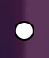
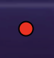

# Pong-Rivals Miami

Basic Pong project using SVG and JS OOP


## Setup

Ensure you have [Node.js](https://nodejs.org/en/) installed first.
Ensure you have [yarn](https://yarnpkg.com) installed first.

**Install dependencies:**

`$ npm install`

**Run locally with the Parcel dev server:**

`$ npm start`

Download the project.

Navigate to the project directory.<br>

`yarn start` in your terminal or powershell.

Once you run the start command you can access your project at http://localhost:3000.

Read more about the [Parcel web application bundler here](https://parceljs.org/).

## Technologies used
* HTML5
* CSS3
* JS ES6
* Node.js
* yarn
* parcel
* Git
* bash 

## How to play 

Start / Pause = SPACE

### Player one:

UP = a <br>
DOWN = Z <br>

### Player two:

UP = k <br>
DOWN = m <br>

### Rules

Players will start with 7 lives each<br>

A ball will be thrown into the arena, the properties of the ball will be "randomly" selected from 3 ball types.<br>

<br>
if the white ball passes a player, that player will lose a life.<br>

<br>
if the blue ball passes the player oponent, player will gain a life.<br>

<br>
if any player comes in contact with the red ball, that player will loose a life.<br>

The speed of the ball will increase over time, from the beginning of each round<br>

## Personal Learnings
* SVG Graphic elements
* JS OOP and partials

## Bug Fix
The base game we started with had a bug in which only one player could press a button at a time.
Accompanied by laggy paddle movement.

My approach to solving this issue was to first isolate the source of the bug in the source code. The ball moved smoothly yet the paddles didnt.
It turned out that the paddles were not getting rendered in their ```render()``` method unlike the ball, meaning their call was once every second, not 60 times per second.
My fix was to move the paddles into their ```render()``` class method and have them called on  ```addEventListener("keydown", )``` and ```addEventListener("keyup", )``` that would return a boolean to identify if the key was ```true``` (on press) and ```false``` (on release);

Then using these values along with their direction calculation:

```javascript
render()
    if(this.movingUp){
        this.y = Math.max(0, this.y - this.speed);
    }
    if(this.movingDown){
        this.y = Math.min(this.boardHeight - this.height, this.y + this.speed);
    }
```

Not only did this solve the issue where the players couldn't press at the same time, but also it gave the paddles smooth motion, greatly increasing the player experience.

## Added functionality
* Player name boxes for win display
* Acceleration on ball throughout each round
* Ball type behaviour, life loss, life gain.

## Environment
* macOS Mojave: 10.14.6
* VS Code: 1.39.1

## Contributing
Please feel free to clone this project.

## Authors
* **Bruce Pouncey** - *Initial work* - [BPouncey](https://github.com/BPouncey)

## License
(MIT)

## Acknowledgments
[RED Academy](https://github.com/redacademy)


